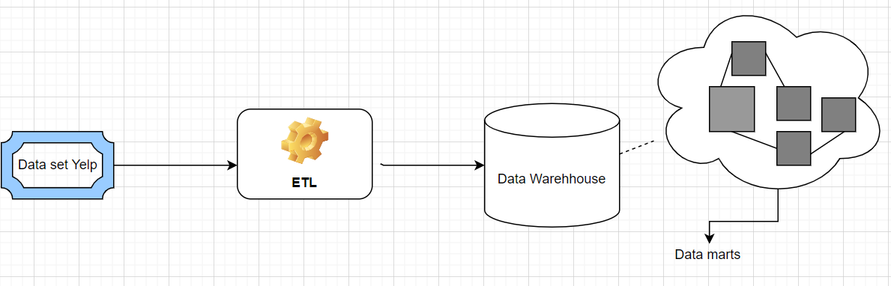
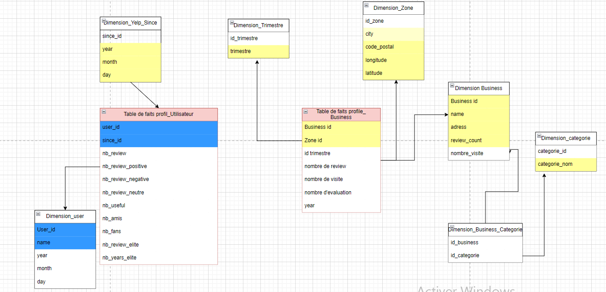
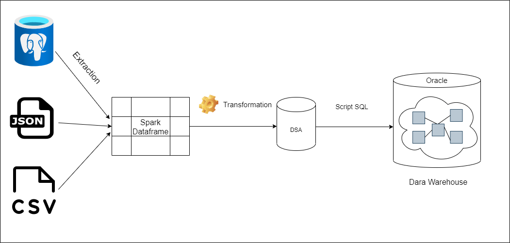
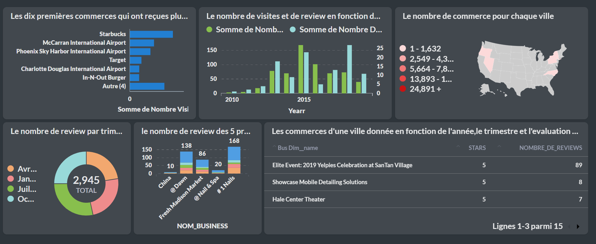
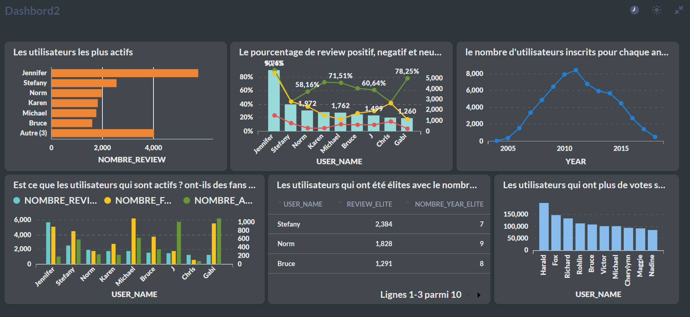

# Data-Warehouse-Yelp

## Analyse 
L'analyse de ce sujet est basé sur des avis d’utilisateurs sur de nombreuses commerces, l'objectif est d'étendre ce sujet en plusieurs analyses  sur différents axes : 

- **Profil utilisateur "user"** : 
    les analyses seront basés sur l'axe des utilisateurs, qui ont un dépendance entre celles - ci.
- **Profil commerce "business"** : 
    ce profil business est un peu complexe, nous allons essayer d'expliquer et répresenter le mieux dans notre schéma de modelisation pour la construction de ce data mart.
    
## Approche

Sachant que l'objectif est de développer une solution de gestion de données conviviale pour les utilisateurs finaux, qui permet une analyse rapide et interactive des données, nous avons opté pour l'architecture de Kimball. 

## Schéma de data warehouse et data mart

Dans ce schéma, il y a deux tables de faits : "commerces" (en flocon) et "utilisateurs" (en étoile) avec plusieurs dimensions.

## ETL : 
Pour la construction de l'entrepôt de données, il est nécessaire de suivre le processus **ETL** (Extract-Load-Transform).

- **Extraction des données :**  
Lors de cette étape, les données sont récupérées à partir de différentes sources : **csv** : tip.csv, **json** : business.json, checkin.json, et une base de données **Postgres** qui contient les différentes tables : user, review, elite, friend. Ensuite, les différentes données ont été chargées dans des dataframes.

- **Transofrmation :** 
  - Nettoyage des données 
  - Extraction des connaissaces à partir des données existantes
  - Discrétisation
  - Encodage des attributs non numériques
  - Jointures entre les différentes sources de données
  - Agrégation en fonction des critères

- **Chargement** 
Après la transformation, nous stockons nos données reparties dans les différentes dataframes **business-fact, user-fact, dim-business, etc...** dans une base de données **Oracle** afin de visualiser nos tables de faits et de dimensions.
Avant de charger les tables finales, nous avons passé par une zone de stockage temporaire. Nous avons par suite crée un script SQL pour terminer la création de la table de fait commerce (business) ainsi que la création de la table de dimension trimestre.

## Tableaux de bord

Pour l'analyse de nos données, nous avons utilisé un outil de visualisation **metabase** pour nous permettre d'effectuer des requetes et de les representer graphiquement.
Pour cela, nous avons deux tableaux de bord, celui du **Profil business** et **Profil User**.
### Profil business 

### Profile utilisateur 

## Technologies et outils utilisés
- Scala
- Spark
- Oracle
- PostgreSQL
- Metabase
- DBeaver
